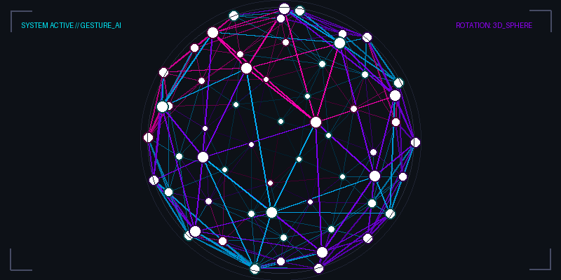

  

<h1 align="center">Hi 👋, I'm Krishna Gupta</h1>
<h3 align="center">AI & ML Engineer • Full Stack Developer • Computer Vision Engineer</h3>

  

---

### 💫 About Me
I'm a B.Tech student specializing in **Artificial Intelligence & Data Science** (2024–2028) at Arya College of Engineering & IT. I love building intelligent, gesture-driven systems, predictive pipelines, and computer vision models that feel like magic and operate seamlessly.

- 💡 **I love working on**: Artificial Intelligence, Machine Learning, and Computer Vision.
- 🚀 **Core Goal**: Building highly scalable AI tools and immersive human-computer interaction (HCI) applications.
- 🌱 **Currently Learning**: Advanced Deep Learning architectures, distributed system scaling, and edge-AI model deployment.

---

### 📂 Featured Projects

#### 🖐️ **ZeroTouchSec** — *Gesture-Driven AI Automation*
> **An innovative Human-Computer Interaction (HCI) system** designed to control laptop actions using real-time hand gestures without touching the device.
> - Developed computer vision models utilizing PyTorch and OpenCV to track and classify hand postures.
> - Implemented system-level triggers enabling seamless, touchless navigation, media control, and application execution.
> - Designed with secure cloud operations and local surveillance tracking in mind.

#### 🎥 **AI-Based Smart Campus Attendance & Surveillance**
> **A multi-camera real-time facial recognition attendance system** designed to track and register students dynamically.
> - Processes live camera feeds, extracting face regions and scaling inputs to high-precision 1280x1280 resolutions.
> - Utilizes L2-normalized embeddings matched against a **Qdrant Vector Database** for sub-millisecond facial search.
> - Features automatic database synchronization and multi-camera spatial tracking.

---

### 🛠️ Technical Stack

<table width="100%">
  <tr>
    <td width="50%" valign="top">
      <h4>💻 Languages & Core</h4>
      
      
      
    </td>
    <td width="50%" valign="top">
      <h4>🧠 AI, ML & Databases</h4>
      
      
      
      
      
    </td>
  </tr>
  <tr>
    <td colspan="2">
      <h4>🔧 Tools & Workflows</h4>
      
      
      
      
      
    </td>
  </tr>
</table>

---

### 📊 GitHub Activity & Analytics

  
  

  

---

### 🌐 Connect With Me

  
  

---

### 🧭 Quick Facts
- 🏫 **College**: Arya College of Engineering & IT, Jaipur
- 📈 **Core Objective**: Build tools that feel like magic and scale effortlessly.
- 📬 **Availability**: Open to internships, research collaborations, and open-source contributions.
